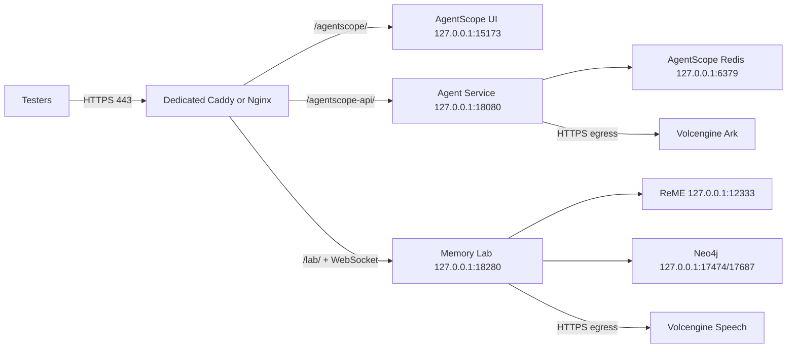

# SRE 任务包：AgentScope 独立验证区与 HTTPS 域名

## 1. 任务摘要

**任务类型**：新建独立测试环境，不是在现有 14 号服务器上继续叠加配置。

**执行责任**：AgentScope 与 Lab 的部署已安排由 SRE 执行。应用侧提供
GitHub 固定提交、CI 结果、GHCR OCI digest 和本任务包，不直接操作目标节点。

**目标**：为 AgentScope `2.0.6dev` 能力验证和 `talk-think-memory-lab`
提供一个独立、可重复部署、有正式测试域名和 HTTPS 的验证区。

**推荐结论**：配置一台独立测试 VM，使用一个可管理的真实域名和
TLS 证书，UI、API 与 Lab 采用同源路径路由。不共享 Lumi/Dify 宿主机、
Caddy、Redis、Neo4j 或应用网络。

**建议任务名**：`TASK-SRE-AGENTSCOPE-VALIDATION-ZONE-001`

**优先级**：P1（阻塞稳定的浏览器交互与能力验收，不影响 Lumi 生产服务）。

## 2. 背景与当前问题

当前临时环境在 `14.103.221.4` 上与 Lumi、Dify 和共享 Caddy 并存，
通过 HTTP IP 路径提供：

- `/agentscope/`：AgentScope Web UI；
- `/agentscope-api/`：Agent Service；
- `/lab/`：Talk · Think · Memory Lab。

该方案可用于短期接口验证，但已出现浏览器安全上下文问题：

- HTTP 公网 IP 不是 secure context；
- AgentScope 前端在发送消息时直接调用 `crypto.randomUUID()`；
- 点击发送按钮时抛出 `TypeError: crypto.randomUUID is not a function`；
- 消息在发起 API 请求前即中断，用户看到的现象是“点击无效”；
- 公网 HTTP 同时不能保护 Basic Auth 和业务流量的链路机密性。

已有本地防御性前端修复，但尚未部署到 14 服务器。新环境仍应使用
HTTPS，不应把前端 fallback 当作网络安全替代品。

## 3. 任务目标

SRE 需要交付一个满足以下条件的独立验证区：

1. 独立计算、存储、容器、进程、反向代理和密钥边界。
2. 使用可管理的测试域名和可验证 TLS 证书。
3. 用户只通过 HTTPS `443` 访问 UI/API/Lab。
4. AgentScope、Lab、Redis、ReME 和 Neo4j 只监听回环地址或独立容器网络。
5. 模型密钥由 SRE 密钥系统注入，不进 Git、工单、命令行、浏览器或验收日志。
6. 只展示在新环境中重新完成真实供应商调用的模型能力。
7. 从环境外部完成 UI 发送、Ark Chat、ASR、WebSocket 和记忆生命周期验收。
8. 验收后再由业务负责人决定是否关闭 14 服务器临时公网入口。

## 4. 范围边界

### 4.1 本次包含

- 独立 VM 或等价的独立运行节点；
- DNS、TLS 证书、HTTPS 入口、入口认证与安全头；
- AgentScope 固定源码与 Web UI/Agent Service；
- AgentScope 独立 Redis；
- Talk · Think · Memory Lab API/UI；
- ReME `0.4.1.3`；
- Neo4j `2026.06.0`；
- 模型密钥安全注入；
- systemd/Docker 开机恢复；
- 外部功能验收、安全验收和回滚演练。

### 4.2 本次不包含

- Lumi S1～S6、DP、Dify、设备鉴权或生产业务接入；
- 任何生产流量、真实儿童数据或真实用户身份；
- 未验证的 TTS、ASR、向量、RAG、Team 或工具能力的“预先上架”；
- 生产级 SLA、异地多活或生产备份承诺；
- 修改 14 服务器上的 Lumi/Dify 组件。

## 5. 推荐拓扑

使用单域名同源路径，减少 CORS、多次认证和基础路径偏差：



建议域名格式：

```text
agentscope-lab-test.<managed-domain>
```

最终 FQDN 由 SRE 根据企业 DNS 区域分配，不使用 `nip.io`、`sslip.io`
或自签名证书作为交付地址。

## 6. 资源申请

| 项目 | 推荐配置 | 说明 |
| --- | --- | --- |
| 计算 | 4 vCPU | 支持 Python 服务、前端构建、Redis、ReME 和 Neo4j |
| 内存 | 16 GiB | 8 GiB 可运行，但构建与 Neo4j 并行时余量不足 |
| 系统盘 | 100 GiB SSD | 源码、Python/Node 依赖、镜像、日志和合成测试数据 |
| 操作系统 | Ubuntu 24.04 LTS x86_64 | 与当前已验证环境一致 |
| GPU | 不需要 | 模型通过火山云 API 调用 |
| 公网 | 1 个可绑定 DNS 的 IP | 如只在 VPN/堡垒机内使用，可改为企业内网域名 |
| 带宽 | 建议 10 Mbps 以上 | 主要是依赖、镜像、Chat 和短音频上传 |

建议保留至少 30% 内存和 30 GiB 磁盘余量；磁盘或内存不足时不得以
删除验收证据或共用 Dify 数据库作为缓解手段。

## 7. DNS、TLS 与入口要求

1. SRE 创建测试 FQDN 并解析到独立节点。
2. 签发可被主流浏览器信任的 TLS 证书，覆盖完整证书链与自动续期。
3. TCP `80` 只做 `308` 跳转到 HTTPS，不提供应用内容。
4. TCP `443` 是唯一用户入口。
5. `/agentscope/`、`/agentscope-api/`、`/lab/` 全部要求入口认证。
6. 优先接入企业 OIDC/SSO 或 VPN 访问策略；如暂不具备，至少使用
   HTTPS + 强随机 Basic Auth，并由密钥系统保管密码。
7. 同源路由需保留 AgentScope UI 的 `/agentscope/` 前缀，API 上游去除
   `/agentscope-api/` 前缀，Lab 上游去除 `/lab/` 前缀。
8. WebSocket 必须支持 HTTPS 下的 `wss://`升级。
9. 建议安全头：`X-Content-Type-Options: nosniff`、合理的
   `Content-Security-Policy`、`Referrer-Policy`，HSTS 先使用短周期验证，不直接
   `includeSubDomains`。
10. AgentScope 初始化页不预填服务地址或用户标识。

AgentScope 初始化时的运行参数为：

```text
Agent Service URL: https://<FQDN>/agentscope-api
User ID: synthetic-test-user
```

## 8. 网络与安全组

### 8.1 入站

| 端口 | 来源 | 用途 | 要求 |
| --- | --- | --- | --- |
| 22/TCP | 堡垒机、VPN 或 SRE 固定出口 | SSH 管理 | 禁止 `0.0.0.0/0` |
| 80/TCP | 测试人员网段 | HTTPS 重定向 | 不提供业务流量 |
| 443/TCP | 企业 VPN/测试人员出口 | 唯一应用入口 | 如必须公网开放，需有认证与合成数据限制 |

### 8.2 不得公开的端口

| 端口 | 组件 | 监听要求 |
| --- | --- | --- |
| 15173 | AgentScope UI | `127.0.0.1` |
| 18080 | Agent Service | `127.0.0.1` |
| 18280 | Lab API/UI | `127.0.0.1` |
| 6379 | AgentScope Redis | `127.0.0.1` 或独立容器网络 |
| 12333 | ReME | `127.0.0.1` |
| 17474 | Neo4j HTTP | `127.0.0.1` |
| 17687 | Neo4j Bolt | `127.0.0.1` |

云安全组、主机防火墙与容器发布端口必须同时满足上述约束。

### 8.3 出站

允许 HTTPS `443` 访问：

- 固定源码与依赖仓库（如 GitHub、PyPI、npm/pnpm、容器镜像源）；
- 火山方舟 OpenAI-compatible 模型端点；
- 火山语音 ASR 端点；
- DNS、NTP 与证书续期所需端点。

如 SRE 实施 FQDN/IP allowlist，必须保留更新机制，不得因供应商 IP 变更
静默降级为未验证能力。

## 9. 软件与版本契约

| 组件 | 版本/来源 |
| --- | --- |
| AgentScope 文档通道 | `2.0.6dev` |
| 应用交付仓库 | `https://github.com/chadwangcn/agentscope-validation-lab.git` |
| AgentScope 官方源码 | `https://github.com/agentscope-ai/agentscope.git` |
| 固定提交 | `9edf84602c3af9399808afa448cd222f8fe1f7f9` |
| 该提交包内版本 | `2.0.5`（必须原样记录，不写成已发布的 `2.0.6.dev` 包） |
| Python | 3.12.x |
| Node.js | 22.x |
| pnpm | 10.14.0 |
| Redis | 7.4 Alpine，需固定 image digest |
| ReME | `0.4.1.3` |
| Lab 内 AgentScope 依赖 | 与服务相同的固定源码 commit，不使用 `agentscope==2.0.4` |
| Neo4j | `2026.06.0`，需固定 image digest |
| 入口 | Caddy 或 SRE 标准 Nginx/Ingress，必须满足本任务的路径与 WebSocket 契约 |

不跟随 AgentScope `main` 漂移。更换源码提交、依赖版本或镜像 digest 必须另行
变更评审并重跑全部验收。

## 10. 应用交付物契约

应用负责人需在 SRE 开始部署前提供：

1. 本项目公开仓库的不可变 Git commit 与交付 tag；
2. GitHub `CI` 与 `OCI` 成功运行链接；
3. 三个 GHCR OCI 镜像的不可变 digest；
4. 三类功能 overlay 与一类容器运行参数 overlay：
   - Redis、Workspace 与默认 MCP 的容器运行参数化；
   - Web UI 基础路径、hash router、API 前缀保留和 HTTP 兼容 ID；
   - Credential HTTP 响应脱敏；
   - 按 Credential 过滤模型目录，并在 Session/Knowledge Base 写入时拒绝未验证模型；
5. Redis/Neo4j 固定 upstream image digest 与运行配置；
6. AgentScope、Lab 部署与验收脚本；
7. 只包含合成数据的外部验收样本。

SRE 不得把开发者本地目录或 Actions 工作区当作发布制品，只部署已通过
CI、与 Git commit 对应并记录 digest 的 GHCR 输入。

### 10.1 仓库与压缩包的交付关系

- 公开 Git 仓库 `https://github.com/chadwangcn/agentscope-validation-lab.git`
  是文档、脚本、契约和源码的唯一事实源。
- 首个 SRE 交付 tag 建议为 `sre-validation-zone-v0.1.0`；tag 必须指向已验证 commit。
- 压缩包只能从该 tag 生成，不得从未提交工作目录手工复制。
- 压缩包不包含 `.git`、`.venv*`、`node_modules`、构建缓存、浏览器轨迹、
  本地日志、测试数据、密钥或运行数据。
- 压缩包交付时同时提供：Git commit、tag、制品 SHA-256、文件清单和生成命令。
- SRE 优先从公开仓库的固定 tag 拉取；只有受限网络或审批流程不允许时，
  才使用同一 tag 导出的离线压缩包。

公开仓库只包含公开源码和脱敏契约。任何 `.env`、密钥文件、模型 ID、
供应商地址、服务器运行数据、日志、浏览器轨迹或验收正文均不得提交。

### 10.2 GitHub CI 与 OCI 交付

GitHub Actions 只构建和发布制品，不部署验证区：

| 组件 | GHCR image |
| --- | --- |
| Agent Service | `ghcr.io/chadwangcn/agentscope-validation-lab-agentscope-service` |
| AgentScope Web UI | `ghcr.io/chadwangcn/agentscope-validation-lab-agentscope-web` |
| Lab API/UI 与 ReME runtime | `ghcr.io/chadwangcn/agentscope-validation-lab-memory-lab` |

- PR 必须完成三镜像 build，但不向 GHCR push。
- `main` 与 `sre-validation-zone-v*` tag 发布 `linux/amd64` 镜像。
- 每个镜像必须有 SBOM、provenance、source/revision OCI label 和 digest。
- SRE 只使用 digest 部署，不使用 `main` 或其他可变 tag 作为发布事实。
- Redis 与 Neo4j 使用 SRE 记录 digest 的 upstream image，不在本仓库重建。
- CI/GitHub Secrets 不保存供应商模型密钥；所有业务密钥只由 SRE Secret Manager
  在运行时注入。
- CI/OCI 成功仅表示源码、测试与镜像层通过，不代表部署或真实模型能力通过。

具体工作流与运行变量见 `docs/CI-OCI.md`。

## 11. 密钥与敏感信息契约

### 11.1 需要的密钥引用

| 用途 | 密钥字段 | 注入方式 |
| --- | --- | --- |
| 火山方舟 Chat | `api_key`、`base_url`、`model` | 一次性配置任务从 SRE Secret Manager 读取，写入独立 AgentScope Redis |
| 火山语音 ASR | `appid`、`api_key` | root-only secret 物化为 `/etc/talk-think-memory-lab/speech.env`，`0640` |
| Neo4j | 随机独立密码 | root-only 文件或 SRE 标准 Docker secret |
| 入口认证 | OIDC client secret 或 Basic Auth hash | SRE Secret Manager；宿主机只保存最小必需材料 |

### 11.2 禁止事项

- 不得把密钥值写入 Git、工单、Wiki、CI 日志或 shell history。
- 不得通过公网 Web UI 创建或编辑模型密钥。
- 不得在验收 JSON 中输出 API Key、base URL、模型 ID、Authorization 头、
  供应商原始响应或用户转写正文。
- 不得复用 Dify/Lumi 的 Redis、Neo4j、数据库密码或入口认证材料。
- 不得以“钥匙串中存在”或“配置页能看到”当作能力验收。

## 12. 模型能力门禁

新环境必须重新执行真实调用，不直接继承 14 服务器的“已验证”标记。

| 能力 | 当前参考结果 | 新环境处理 |
| --- | --- | --- |
| Ark Chat | 供应商调用、AgentScope adapter 和 Agent Service 会话均通过 | 重测通过后才显示唯一 Chat 模型 |
| 火山 ASR | 已用已知语义合成 WAV 通过供应商与 Lab 公网 API 验证 | 重测通过后才在 Lab 显示 `validated` |
| TTS | 真实调用失败 | 保持 `not_configured`，不显示、不可选 |
| Embedding | 真实调用失败 | 保持 `not_configured`，不显示、不可选 |

一项能力只有同时满足以下条件才可上架：

1. 新节点完成供应商真实调用；
2. HTTP/供应商状态码通过；
3. 响应 schema 通过；
4. 返回内容非空，并通过已知语义断言；
5. AgentScope 或 Lab 实际 adapter/API 路径通过；
6. UI 实际可操作；
7. 证据已脱敏，无密钥和原始供应商包。

## 13. 部署步骤

### 阶段 0：输入冻结

- SRE 填写最终 FQDN、节点 ID/IP、网段、Secret Manager 引用和维护人。
- 应用负责人提供不可变代码/制品 digest。
- 应用负责人提供成功的 GitHub CI/OCI run 与三个 GHCR image digest。
- 确认数据策略为“仅合成测试数据”。

### 阶段 1：基础资源

- 创建 VM、专用数据盘/目录、独立安全组、系统用户和 SSH 访问。
- 安装 SRE 基线补丁、时间同步、日志轮转与标准 OCI 容器运行时；目标节点不承担源码构建。
- 建立 `/opt/agentscope-2.0.6dev`、`/opt/talk-think-memory-lab`、
  `/var/lib/talk-think-memory-lab` 和对应 root-only 配置目录。

### 阶段 2：DNS/TLS/入口

- 创建 DNS 记录，部署 Caddy/Nginx/Ingress 和 TLS 证书自动续期。
- 只在当地上游尚未启动时安装入口配置，预期返回 `502`；不得为通过健康检查临时开放高端口。
- 验证 HTTP 重定向、TLS 证书链、入口认证和 WebSocket 升级。

### 阶段 3：AgentScope

- 拉取已验收 digest 的 Agent Service 与 Web UI OCI，不在节点上跟随 upstream `main` 构建。
- 核对 OCI source/revision label、SBOM、provenance 与任务记录一致。
- 部署独立 Redis，并通过私有容器网络连接 Agent Service。
- UI/API 只监听 `127.0.0.1`。
- 先运行无模型密钥的安装/路由验收。

### 阶段 4：Lab

- 创建独立 `talkthinklab` 系统用户。
- 按已验收 digest 部署 Lab API/UI，使用相同镜像的独立命令启动 ReME，并部署独立 Neo4j。
- 执行 Neo4j constraint/index schema。
- Lab、ReME、Neo4j 只监听回环地址。
- 运行无供应商密钥的健康、存储、WebSocket 与记忆生命周期验收。

### 阶段 5：密钥与能力验证

- 通过 SRE Secret Manager 临时获取 Ark 配置，从服务器内运行真实测试。
- 通过后再幂等创建 Credential、唯一 Chat 模型卡、Smoke Agent 和 Session。
- 注入 ASR 运行密钥，使用已知语义合成 WAV 完成供应商与 Lab API 双重验收。
- 不注入、不创建、不显示未通过的 TTS 与向量能力。

### 阶段 6：外部验收

- 从验证区外部的真实浏览器执行第 14 节全部用例。
- 保留脱敏 JSON、截图、证书证据、监听端口证据和服务重启证据。
- 验收未通过时不进行 14 服务器切换或关闭。

## 14. 验收清单

### A. 基础资源与隔离

- [ ] VM 规格、OS、IP、存储和维护责任人已记录。
- [ ] 新节点不运行 Lumi/Dify 生产组件。
- [ ] AgentScope Redis 与 Neo4j 均为新建独立实例。
- [ ] 所有 systemd 服务与容器在重启后自动恢复。
- [ ] 数据目录、配置目录与文件权限满足最小权限。

### B. DNS/TLS/认证

- [ ] FQDN 在目标网络中正确解析。
- [ ] HTTP `80` 只重定向 HTTPS。
- [ ] TLS 证书域名、有效期、证书链与续期机制通过。
- [ ] 未认证的 `/agentscope/`、`/agentscope-api/`、`/lab/` 返回 `401/403`。
- [ ] 认证后三个路径返回成功，且密码/令牌不出现在 URL。
- [ ] 浏览器 `window.isSecureContext === true`。
- [ ] `wss://<FQDN>/lab/ws/v1/spaces/<synthetic-space>/events` 建连成功。

### C. 端口与网络

- [ ] 公网/测试网段只能访问 `80/443`。
- [ ] `15173/18080/18280/6379/12333/17474/17687` 从节点外部不可达。
- [ ] 节点内 `ss -ltn` 证据显示上述服务只在回环或隔离网络。
- [ ] 火山方舟与火山语音 HTTPS 出站正常。

### D. AgentScope 安装与版本

- [ ] OCI source/revision label 指向本交付 Git commit，依赖锁指向固定 upstream commit。
- [ ] overlay 文件集与任务包清单完全一致。
- [ ] `git diff --check`、TypeScript build 与部署验证脚本通过。
- [ ] OpenAPI 可读取，Agent、Session、Credential、Model、Schedule、Workspace、Knowledge Base 路由存在。
- [ ] 验收记录同时保留文档通道、Git commit 和包内版本。

### E. 浏览器实际交互

- [ ] 页面无空白屏、无框架错误遮罩、无相关 console error/warn。
- [ ] 在新会话中输入合成测试文本并点击上箭头，输入框清空且用户消息立即出现。
- [ ] 网络证据显示 `POST /agentscope-api/chat/` 发出并返回成功。
- [ ] Ark 真实回复结束，页面收到完整事件并显示非空回复。
- [ ] 刷新页面后可从历史记录重新读取该轮消息。
- [ ] 点击发送不再出现 `crypto.randomUUID is not a function`。
- [ ] 上传合成文本文件时产生有效 ContentBlock，不出现同类 ID 异常。

### F. 模型与密钥

- [ ] AgentScope Credential 响应只包含 `type` 和 `name`，无 API Key/base URL。
- [ ] Ark Credential 只返回 1 个在新环境真实通过的 Chat 模型。
- [ ] Ark TTS 目录为 0，Embedding 目录为 0。
- [ ] 服务端拒绝未验证 Ark Chat/TTS Session 和 Ark Embedding Knowledge Base 写入。
- [ ] Ark adapter 非流式调用返回非空回复并包含 usage。
- [ ] Agent Service 完整会话返回已知语义结果并以 `completed` 结束。
- [ ] 仓库、日志、验收 JSON 和浏览器响应的密钥值扫描命中数为 0。

### G. ASR 与 Lab

- [ ] `/lab/api/v1/capabilities` 只显示 ASR `validated`，Chat/TTS/Embedding 为 `not_configured`。
- [ ] 在公网 HTTPS Lab 页面上传已知语义合成 WAV，返回非空且语义正确的转写。
- [ ] `speech.asr.completed` 事件存在，但 JSONL/SQLite 不持久化转写正文或音频内容。
- [ ] `/chat`、`/memories`、`/evaluations`、`/ui/status`、`/health`、`/status` 在入口认证后可访问。
- [ ] 合成记忆完成创建、评审、发布、撤回、回收、恢复和清除闭环。
- [ ] ReME 和 Neo4j 健康，且从节点外部不可达。

### H. 稳定性与回滚

- [ ] 依次重启 Agent Service、UI、Lab、ReME、Redis、Neo4j 后恢复健康。
- [ ] 节点重启后所有必需服务自动启动。
- [ ] 回滚到上一个制品 digest 后 UI/API/Lab 恢复。
- [ ] 回滚不覆盖密钥、持久化卷或验收证据。
- [ ] 最近 30 分钟服务无未解释的 error 级日志。

## 15. 验收证据包

SRE 交付的证据包必须至少包含：

1. 资源清单（节点 ID、规格、OS、网段、域名）；
2. DNS 解析与 TLS 证书链证据；
3. 安全组、主机防火墙与 `ss -ltn` 脱敏证据；
4. 安装源 commit、overlay 清单、依赖版本和镜像 digest；
5. systemd/Docker 状态与重启恢复证据；
6. 外部 HTTP/HTTPS/认证/WebSocket 验收 JSON；
7. AgentScope 发送前、回复完成后的页面截图和脱敏网络证据；
8. Ark Chat 和 ASR 真实调用的布尔/语义级证据；
9. TTS/Embedding 保持未配置的证据；
10. 密钥值扫描命中数为 0 的证据；
11. 回滚演练记录。

证据包只保留阶段结果、状态码、计数、安全标识和合成对象 ID。
不得保留密钥、Authorization 头、供应商原始响应或真实个人数据。

## 16. 切换与 14 服务器处理

1. 新环境和 14 服务器允许短期并行。
2. 新环境未完成第 14 节验收前，不关闭 14 环境。
3. 验收通过后，应用负责人明确授权后再执行：
   - 将用户验证地址切换为新 HTTPS FQDN；
   - 执行 14 服务器 `public-access.sh close`；
   - 从 14 服务器共享 Caddy 移除 AgentScope/Lab 临时公网路由；
   - 根据单独的保留策略删除或归档合成测试数据。
4. 未获得明确授权时，SRE 不删除 14 服务器的 Redis 卷、工作区、会话、
   SQLite、JSONL 或 Neo4j 数据。

## 17. 回滚方案

### 应用回滚

- 保留上一个通过验收的源码/制品 digest与 systemd unit。
- 回滚只替换代码、静态构建和 unit，不覆盖 secret 或数据卷。
- 回滚后重跑健康、路由、鉴权和一次合成 Chat 验证。

### 入口回滚

- 入口配置使用候选校验、原子替换和带时间戳备份。
- 新配置健康检查失败时自动恢复上一份并重载。
- 回滚不允许临时绕过认证或放开高端口。

### 整体故障回退

如新验证区不可用，且 14 环境尚未关闭，验证人员可临时回到
14 环境进行 API 级诊断；不把 14 环境的 HTTP 公网 IP 视为稳定 UI 交付。

## 18. 数据与日志保留

- 只使用合成测试空间、合成用户和合成音频。
- 建议应用数据保留 14 天，日志保留 14 天，具体以 SRE 测试区策略为准。
- ASR 转写正文和上传音频不进入 JSONL/SQLite 持久化轨迹。
- 服务日志不记录 request body、Authorization、API Key、模型原始响应或会话正文。
- 清理会话、记忆、Redis 卷或 Neo4j 数据前必须有明确保留决策。

## 19. 责任分工

| 责任方 | 责任 |
| --- | --- |
| SRE | VM、DNS、TLS、网络、防火墙、入口、Secret Manager、OCI 部署、日志、发布与回滚 |
| 应用负责人 | 固定 Git/OCI 制品、overlay、CI、验收脚本、模型门禁、合成测试数据 |
| 验证负责人 | 浏览器业务闭环、能力语义断言、证据签收与 14 环境切换授权 |
| 安全/合规（如需） | 公网暴露、身份接入、日志脱敏和数据保留评审 |

## 20. SRE 开工前需回填的信息

```text
Environment name:
Cloud account / region:
VM or node ID:
Private IP:
Public IP (if any):
FQDN:
DNS zone owner:
TLS issuer and renewal method:
Allowed tester CIDRs / VPN:
SSH bastion / operator group:
Secret Manager references:
Ingress implementation:
Log platform and retention:
Maintenance owner:
Expected delivery date:
Rollback owner:
```

## 21. 完成定义

仅当以下条件全部成立时，本任务才能标记完成：

1. 第 14 节所有应验收项有对应证据；
2. 域名、TLS、认证、端口隔离和回滚均通过；
3. 真实浏览器点击发送并获得 Ark 回复；
4. ASR 在 HTTPS Lab UI 上完成已知语义转写；
5. TTS 和 Embedding 仍为未配置；
6. 密钥泄露扫描命中数为 0；
7. 三个实际部署 OCI digest 与 GitHub 交付记录一致；
8. SRE、应用负责人和验证负责人完成签收；
9. 14 环境的后续关闭/保留策略被单独记录，不在本任务中默认删除。
