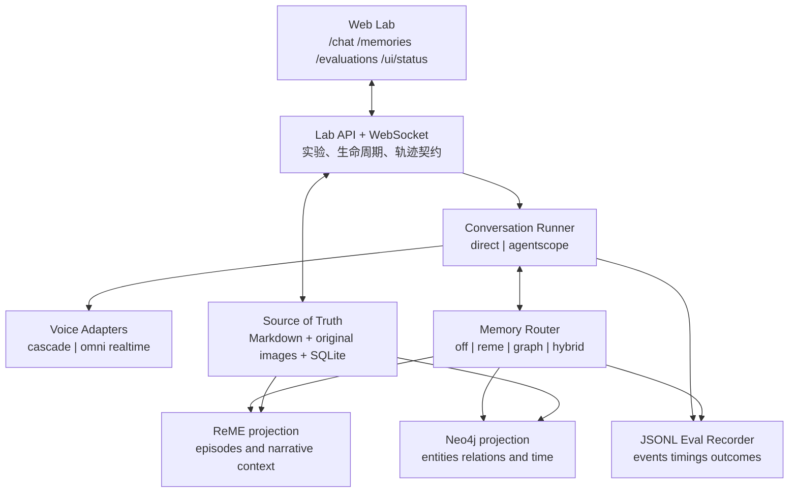

# 整体设计复核

## 结论

`talk-think-memory-lab` 应保持为独立实验系统，而不是 AgentScope 示例服务的二次开发。
AgentScope 只保留为可切换 Runner，用于比较 `direct` 与 `agentscope` 两种编排方式；
实验事实、记忆事实和评测结果均由 Lab 自己管理。

第一版采用四层边界：



## 1. 权威数据与派生数据

必须明确区分：

- 权威事实：原始 `memory.md`、原始图片、人工确认的 frontmatter、生命周期状态；
- 运行事实：会话、轮次、实验组、事件时间戳、用户反馈；
- 派生投影：ReME daily/digest、OCR、图片描述、Embedding、Neo4j 节点与关系、缓存。

撤回只关闭召回，不删除权威事实。重建只删除派生投影。永久删除必须对权威数据和所有
投影做级联清理，并产生可核对的清理报告与残留引用数。

## 2. 发布应采用可恢复工作流

发布不是一个同步数据库更新，而是一条可重试的工作流：

1. 校验 Markdown、frontmatter、相对图片路径和 MIME；
2. 固化原始文件版本；
3. 生成 OCR、图片描述和 ReME 候选；
4. 生成实体、关系、事件和冲突候选；
5. 人工修改与确认候选；
6. 写 ReME 与 Neo4j 投影；
7. 只有两类投影均成功后才把记忆标记为 `published`；
8. 失败时保持 `review` 并记录可重试原因，不能出现半发布但可召回的状态。

第一阶段可用 SQLite job/outbox 表实现，不需要 Redis 或 Kafka。

## 3. 记忆隔离必须在模型之外强制

`memory_space_id` 由 API 从路径和会话绑定中注入，模型、工具参数和前端请求体都不能
覆盖它。所有 SQLite 主键/索引、ReME workspace、Neo4j 查询、文件目录、缓存键和 JSONL
轨迹都必须包含相同空间标识。

Neo4j 查询必须由 repository 层追加空间限定；禁止把模型生成的任意 Cypher 直接执行。
跨空间泄漏测试应同时覆盖 ID 猜测、搜索、图谱多跳、撤回缓存和并发会话。

## 4. Speech Gate 是独立状态机

Speech Gate 不能散落为多个 `if mute`。建议状态：

```text
idle -> listening -> thinking -> recalling/tooling -> speaking
                                  |                   |
                                  +-- muted ----------+
speaking/listening/thinking -> interrupted -> idle
```

约束：

- `recalling/tooling` 阶段只允许播放白名单中的预录短音频；
- JSON、tool call、thinking、内部 hint 永远不能进入 Talker 队列；
- 每段待播放音频绑定 `session_id + turn_id + generation_id`；
- 打断时先递增 generation，再清空队列并停止播放器，旧分片到达后直接丢弃；
- Speech Gate 的每次开关都写入轨迹，才能证明“工具参数被朗读 0 次”。

## 5. 两类语音链路必须共享实验契约

级联链路与 Omni 链路只在 adapter 内不同，Runner 看到统一事件：

```text
input.started
input.partial_transcript
input.committed
memory.prefetch.started/completed
thinker.started/completed
tool.started/completed/failed
talker.first_audio/audio_chunk/completed
playback.started/interrupted/completed
turn.completed/failed
```

事件使用服务端单调时钟计算耗时，并保留 provider 时间戳作为辅助字段。首个可听音频是
浏览器真正开始播放的时间，不是服务器收到首个音频分片的时间。

## 6. 记忆查询应先做预取，再比较工具调用

第一轮默认 `prefetch`：partial transcript 只用于召回，最终理解仍使用原始音频。对照组
`tool_call` 必须在同一测试集、人格、模型和播放环境下运行。Context Pack 采用固定 schema：

```json
{
  "facts": [],
  "episodes": [],
  "conflicts": [],
  "source_turn_ids": [],
  "retrieved_at": "",
  "memory_space_id": ""
}
```

每条事实和经历必须有来源、时间、置信度和检索分数。前端展示的“为什么记得”直接读取
该对象，不从最终回答反向猜测。

## 7. 服务器部署决策

14 号服务器无 GPU，因此：

- Qwen3-Omni 使用实时 API 适配器；
- Qwen2.5-Omni 本地模型不在本机部署，只保留远端 GPU adapter 契约；
- Neo4j、ReME、FastAPI、SQLite/JSONL 和 Web UI 可部署在本机；
- 所有服务先仅监听 loopback，通过 SSH 隧道访问；
- 模型凭证运行时注入，不写入仓库、日志或证据。

## 8. 验收分层

1. 来源层：固定包版本、镜像 digest、源码提交；
2. 结构层：状态机、空间隔离、API/WS schema、图谱约束；
3. 服务层：进程、端口、重启、持久化、撤回与恢复；
4. 真实能力层：实时模型、打断、工具 Speech Gate、ReME/图谱召回；
5. 实验结论层：V0/V1、M0-M3 的统计门槛和人工盲测。

前四层中的任意健康检查或 HTTP 200 都不能替代第五层结论。
